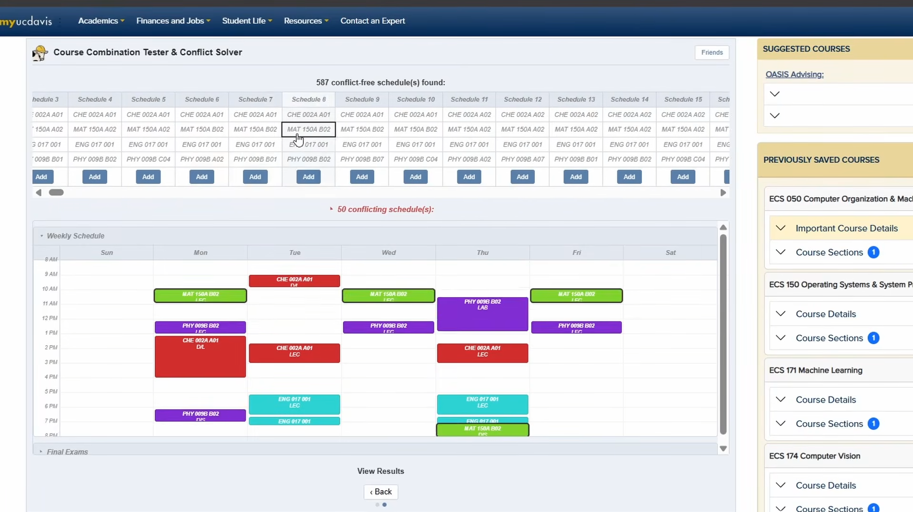

# ScheduleBob

**An automatic schedule builder & course conflict solver for UC Davis ScheduleBuilder.**

ScheduleBob is a Chrome extension that lives inside UC Davis's ScheduleBuilder. You tell it which courses you want, anywhere from *"any philosophy course that fits"* to *"this exact section, because my friends are in it"*, and it finds every conflict-free schedule, shows each one on a calendar, and saves the one you pick back into ScheduleBuilder in one click.

Empty schedule five minutes before your pass time? Can we fix it? Yes we can (probably).



---

## How to use it

1. **Install the [extension](https://chromewebstore.google.com/detail/schedulebob/hppjpajaokjnhgbdebocfjkihpdfjgbl)**. Clicking the toolbar icon gives you a shortcut to ScheduleBuilder.

2. **Open ScheduleBuilder** for your term. The ScheduleBob panel appears right on the page. There's no separate login, because it uses your existing UC Davis session.

3. **Fill in your course slots.** Each row is one course you want in your schedule. Type a query such as `CSE 101`, an instructor's last name, or a keyword. Matching courses appear as you type, as cards you can toggle on/off and narrow down to specific sections.
   - Click **+** on a row to give that slot alternatives (e.g. `PHI 1` *or* `PHI 5`).
   - **Import Current Schedule** fills the rows from the schedule you have open; **Clear** resets them.
   - Leaving the course or section number blank widens the search and gives you more possible schedules.

4. **(Optional) Add Custom Timeblocks** for time you need free, like work, club meetings, or the gym. ScheduleBob treats them as fixed commitments that classes can't overlap.

5. **Click Find Schedules.** You'll see how many conflict-free schedules exist, laid out as a table with one column per schedule.
   - Hover over a column to preview it on the **weekly calendar** and the **finals calendar**.
   - Hover over a course to highlight its time blocks.
   - Schedules that *do* conflict are tucked into a collapsed section below, in case you want to plan around a small overlap.

6. **Click Add** on the schedule you like and give it a name. ScheduleBob creates it in ScheduleBuilder and it shows up instantly, with no page reload. From there you register as usual.

**Friends (optional):** Click **Friends** and sign in with Google to send friend requests, see the courses your friends have shared, and add any of them to one of your slots with one click.

---

## How it works

```
 course queries ──► ScheduleBuilder search API ──► parse into course slots
                                                          │
 custom timeblocks ───────────────────────────────────────┤
                                                          ▼
                                     backtracking search with pruning
                                                          │
                     ┌────────────────────────────────────┴───────┐
                     ▼                                            ▼
          conflict-free schedules                       conflicting schedules
                     │
                     ▼
        table + weekly / finals calendars ──► "Add" ──► ScheduleBuilder API
                                                         + live page-state sync
```

## Tech stack

| Area | Technology |
|---|---|
| Platform | Chrome Extension, Manifest V3 (content scripts, background service worker) |
| Language / UI | Vanilla JavaScript, HTML, CSS (no framework, no bundler) |
| Data source | ScheduleBuilder's internal endpoints, reverse-engineered from the site's own AJAX calls |
| Auth | Google OAuth 2.0 via `chrome.identity.launchWebAuthFlow` |
| Backend (friends) | Supabase (Postgres + REST API) |
| Persistence | `chrome.storage.local` |
| Testing | Jest |
| Build | Makefile that packages a versioned `.zip` |

## Key design decisions

### Calling the host site's API instead of scraping the page
The extension doesn't parse HTML. It calls the same endpoints ScheduleBuilder's frontend uses (`search.cfc`, `createSchedule.cfm`, `addCourseToSchedule.cfm`, …), with the request formats taken from captured network traffic (see `HostSiteReferences/`). Requests run in the student's authenticated session, so ScheduleBob never asks for credentials and gets structured JSON back instead of brittle DOM.

### Backtracking with lecture-group pruning
Generating schedules is a constraint-satisfaction problem: choose one section per slot so that no two meetings overlap. A naive cartesian product blows up quickly, so `createAllPossibleSchedules` uses recursive backtracking and rejects a branch as soon as it conflicts. It also prunes by **lecture group**: UC Davis sections like `A01`, `A02`, … share lecture `A`, so once lecture `A` conflicts, every discussion and lab under it is skipped without being checked. Meeting days are stored as character arrays so the overlap test stays cheap.

### Final exams as date-keyed meetings
Finals are parsed into the same meeting shape as regular classes, but their "day" is a calendar date (`2026-06-05`) instead of a weekday letter. That way one conflict function handles both cases: a final can only collide with another final on the same date, never with a Tuesday lecture.

### Crossing the content-script boundary
Chrome content scripts run in an isolated world and can't touch the page's JavaScript variables. Saving a schedule through the API alone left ScheduleBuilder's in-memory state stale until the page was refreshed (the first attempt was literally committed as `[BUGGY]`). The fix was to inject a page-world script (`bridge.js`) and talk to it with a promise-based `postMessage` protocol (`pageBridge.js`). The bridge reads `window.Schedules` for **Import Current Schedule** and updates the page's state after each API write, so new schedules appear immediately. Follow-up fixes corrected CRN handling and made removal target schedules by name instead of by the active index.

### From a 3-step wizard to search-as-you-type
The first UI was a three-phase wizard: search, then refine, then results. In practice, bouncing between steps to fix a typo was slow, so search and refinement were merged into one live view. Each input is debounced (400 ms, 3-character minimum), stale requests are cancelled with `AbortController`, and recent results sit in a 20-entry LRU cache.

### Keeping the UI responsive
- Schedule computation is synchronous, so the loading overlay is painted first (`requestAnimationFrame` + `setTimeout`) before the heavy work starts.
- Section lookups when adding a schedule run in parallel (`Promise.all`) with a 30 s timeout and per-step progress on the button.
- Conflicting combinations are capped at 500 so a broad search can't freeze the page.
- Results-table handlers use one-time event delegation, which fixed a bug where each **Find Schedules** click attached another listener and opened N duplicate modals.

### Privacy-first social features
Seeing what classes friends are taking was a requested feature, but looking up other students by their university ID raises FERPA and policy concerns. ScheduleBob instead uses **opt-in sharing between mutual friends**, keyed by Google identity. Students choose to share course names, and university identifiers are never stored. Sign-in moved from `getAuthToken` to `launchWebAuthFlow` for reliability, and the extension `key` is pinned so the OAuth redirect URL stays stable.

### Testable without a browser
Core logic (`parseData.js`, `createAllPossibleSchedules.js`, `parseCustomTimeBlocks.js`) is written as plain functions with a `typeof module` guard on the exports. The same files load as Chrome content scripts and run in Jest, covering parsing, conflict detection, pruning, finals, and timeblocks.

## Project structure

```
manifest.json                  Extension config, script load order, permissions
html-files/main-panel.html     Panel markup injected into ScheduleBuilder
popup/                         Toolbar popup
scripts/
  content.js                   Panel UI, search-as-you-type, results, add-to-schedule flow
  search.js, getPidm.js,       Wrappers around ScheduleBuilder endpoints
  getTermCode.js, scheduleAPI.js
  parseData.js                 API response → course-slot structure (incl. finals)
  parseCustomTimeBlocks.js     Timeblock UI → meeting objects
  createAllPossibleSchedules.js  Backtracking schedule generator
  weekCalendar.js              Weekly + finals calendar component
  friendsModal.js              Friends UI
  bridge.js / pageBridge.js    Page-world bridge and its promise-based client
  background.js                Service worker: Google OAuth, Supabase calls
  supabaseClient.js            Supabase REST helpers
tests/                         Jest test suites
HostSiteReferences/            Captured ScheduleBuilder requests/responses used for reverse engineering
docs/README.md                 Development backlog and ideas
```

## Development

```bash
npm install      # installs Jest
npx jest         # run the test suites
make             # package builds/ScheduleBob-<version>.zip
```

To run a local copy, go to `chrome://extensions`, turn on *Developer mode*, and click *Load unpacked* on the repo folder. After making changes, reload it from the same page.

This project was built with AI pair-programming (Claude), which is noted in the commit history. Architecture, product decisions, reverse engineering of the host site, and testing direction were my own.

## Roadmap

- Suggest ways to loosen the search when no conflict-free schedule exists
- Rate My Professor ratings per section, with per-schedule stats (min / max / average)
- Adjustable overlap tolerance, with instructor contact info for requesting permission to add (PTA numbers)
- Seat availability and course notes as extra constraints

See [`docs/README.md`](docs/README.md) for the full backlog.
